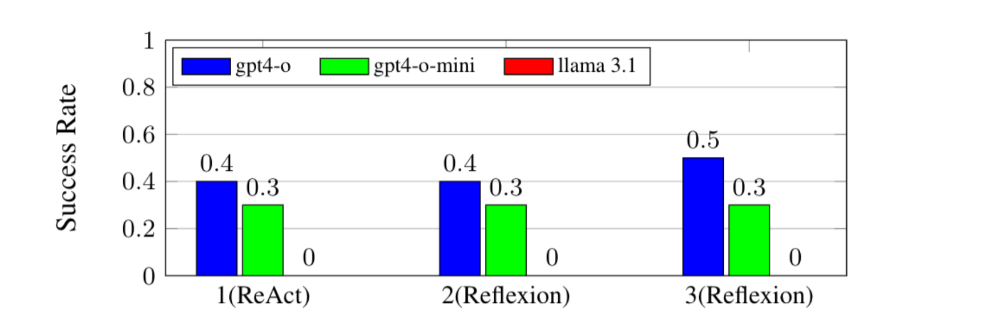
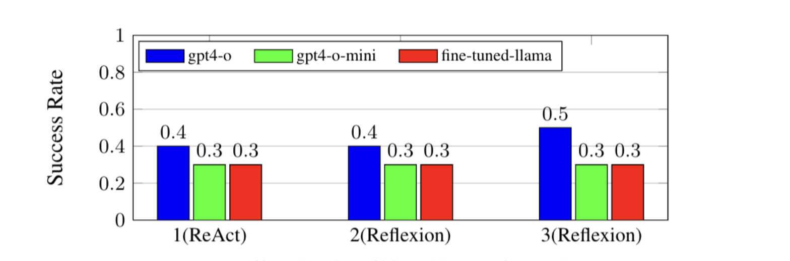

# WebShop_Agent

**Finetuning an LLM for acting in the WebShop environment**

## Overview

In order to build grounded language agents, we require interactive environments that contain: (1)
language elements that reflect real-world usage (2) task feedback that is well-defined and automatically
computable to facilitate interactive learning. WebShop is a simulated e-commerce website environment with 1.18 million real-world products and 12,087 crowd-sourced text instructions. In this environment, an agent needs to navigate multiple types of webpages and issue diverse actions to find, customize, and purchase a product given an instruction.

For a large language model (LLM) to act correctly and effectively in a complex interactive environment, it is crucial for the model to generate coherent reasoning and make decisions aligned with that reasoning. However, traditional LLMs are not inherently trained to operate in this manner. 

Reasoning traces refer to the step- by-step thought processes generated by LLMs to explain or justify their decisions and actions in completing complex tasks. Aligning an LLM with such reasoning traces can help it develop an understanding of the reasoning processes required to act appropriately in dynamic environments. 
Goal is to fine-tune an open-source LLM using reasoning traces generated from actions performed in the WebShop environment to improve the model’s ability to make decisions and act effectively within interactive settings

## Reasoning Traces

<strong>ReAct</strong> combines reasoning and acting with LLMs to solve tasks involving language reasoning and decision-making. It prompts LLMs to interleave reasoning traces with corresponding actions, allowing them to dynamically plan and adjust high-level strategies (reason to act) while interacting with external environments to gather new information (act to reason).

<strong>Reflexion</strong> proposes an alternative approach where agents learn from past mistakes through verbal reinforcement. It converts binary or scalar feedback from the environment into textual summaries, which are then provided as additional context for the agent in future interactions. This self-reflective feedback serves as a "semantic" gradient, guiding the agent toward improvements and better task performance in subsequent episodes

We collect reasoning traces using Reflexion with a ReAct agent.

## Fine-tuning

### Approach 1 - Instruction tuning

**Data Format**

Data is in the form of conversations like so -

```
{'conversation': [{'role': 'user',
   'content': 'WebShop\nInstruction:\ni want a noise cancelling cosycost usb microphone, and price lower than 60.00 dollars\n[Search]'},
  {'role': 'assistant', 'content': 'reset'},
  {'role': 'user',
   'content': 'WebShop\nInstruction:\ni want a noise cancelling cosycost usb microphone, and price lower than 60.00 dollars\n[Search]'},
  {'role': 'assistant',
   'content': 'search[noise cancelling cosycost usb microphone]'},
  {'role': 'user',
   'content': '[Back to Search]\nPage 1 (Total results: 50)\n[Next >]\n[B0972Q1T8T]\nCosycost USB Microphone,Condenser Computer PC Gaming Microphone for PS4/5 Laptop Windows Mac OS Android Phone,Noise Cancelling Instant Mute,Studio Mic for Voice,Music Recording,Podcasting,Streaming\n$32.99\n[B072L2D6LY]\nAndrea Communications NC-255VM USB On-Ear Stereo USB Computer Headset with Noise-Canceling Microphone, in-Line Volume/Mute Controls, and Plug\n$34.59\n[B071H84LTJ]\nAndrea Communications NC-455VM USB Over-Ear Circumaural Stereo USB Computer Headset with Noise-Canceling Microphone, in-Line Volume/Mute Controls, and Plug\n$49.24'},
  {'role': 'assistant',
   'content': 'think[B0972Q1T8T is a noise cancelling cosycost usb microphone and is under 60 dollars. I can check it first.]'},
  {'role': 'user', 'content': 'OK.'},
  {'role': 'assistant', 'content': 'click[B0972Q1T8T]'},
  {'role': 'user',
   'content': '[Back to Search]\n[< Prev]\nCosycost USB Microphone,Condenser Computer PC Gaming Microphone for PS4/5 Laptop Windows Mac OS Android Phone,Noise Cancelling Instant Mute,Studio Mic for Voice,Music Recording,Podcasting,Streaming\nPrice: $32.99\nRating: N.A.\n[Description]\n[Features]\n[Reviews]\n[Attributes]\n[Buy Now]'},
  {'role': 'assistant',
   'content': 'think[The item is a noise cancelling cosycost usb microphone and is priced at $32.99, which is under $60. It seems good to buy.]'},
  {'role': 'user', 'content': 'OK.'},
  {'role': 'assistant', 'content': 'click[Buy Now]'}]}
```

Used Unsloth to finetune a 4-bit quantized version of the Llama 3.1 8B instruct model.
Llama 3.2 does poorly.

Results -

Pre-finetuning :


Post-finetuning :


Model performs to the level of gpt-4o-mini. Doesn't improve with succesive Reflexion trials.

### Approach 1 - Reinforcement Learning


```
@inproceedings{yao2022webshop,
  bibtex_show = {true},
  title = {WebShop: Towards Scalable Real-World Web Interaction with Grounded Language Agents},
  author = {Yao, Shunyu and Chen, Howard and Yang, John and Narasimhan, Karthik},
  booktitle = {ArXiv},
  year = {preprint},
  html = {https://arxiv.org/abs/2207.01206},
  tag = {NLP}
}
```

```
@misc{shinn2023reflexion,
      title={Reflexion: Language Agents with Verbal Reinforcement Learning}, 
      author={Noah Shinn and Federico Cassano and Edward Berman and Ashwin Gopinath and Karthik Narasimhan and Shunyu Yao},
      year={2023},
      eprint={2303.11366},
      archivePrefix={arXiv},
      primaryClass={cs.AI}
}
```